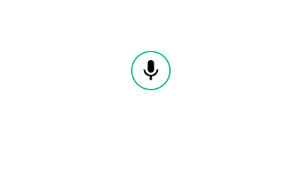

# vue-audio-tapirus [](https://www.npmjs.com/package/vue-audio-tapir) [](https://www.npmjs.com/package/vue-audio-tapir) 

Audio recorder component for Vue.js 3. It enables to record an audio message and send them to a server in a HTTP POST body.


## Use Case

The most popular use case of vue-audio-tapirus is to deliver an audio contact message directly from a website to your server.


 
## Architecture Overview


The developer includes the vue-audio-tapirus component in his Vue 3 website. When the user of the website
wants to leave a voice message, he records his message and submits it. Vue-audio-tapir contacts the
backend server, a Netlify serverless function and uploads the audio data. 

## Installation

In a Vue 3 application install with:

```bash
npm i vue-audio-tapirus --save
```

or
```bash
yarn add vue-audio-tapirus --save
```

## Example Usage in vue3

```html
<template>
  <TapirusWidget :time="2" backendEndpoint="https://your-endpoint.com/.netlify/functions/audio-message" 
                 buttonColor="green"/>
</template>

<script>
import TapirusWidget from 'vue-audio-tapirus';
import 'vue-audio-tapirus/dist/vue-audio-tapirus.css';

export default {
  name: 'App',
  components: {
    TapirWidget,
  }
}
</script>
```

## Properties

| Name             |  Type    | Description                                       | 
|------------------|----------|---------------------------------------------------|
| time             | Number   | Maximum recording time in minutes                 |
| bitRate          | Number   | Bit rate of recording                             |
| sampleRate       | Number   | Sample rate of recording                          |
| backendEndpoint  | String   | URL of the service that receives the data as POST |
| buttonColor      | String   | Color code of the buttons for theming             |
| afterRecording   | Function | Callback function when recording is finished.     |
| successfulUpload | Function | Callback function that is called when data is uploaded successfully. |
| failedUpload     | Function | Callback function that is called when upload failed. |
| customUpload     | Function | Custom upload function that expects the audio blob as parameter. Returns true when successful, false when error. |

The data sent to the server is encoded in the WAV format.

## Compatibility

Successfully tested with applications that use Vue 3 and inertiajs. 

## Dependencies

- [Vue 3](https://v3.vuejs.org/)
- [Tailwindcss](https://tailwindcss.com/)

## Further Reading

- [Web Audio API on MDN](https://developer.mozilla.org/en-US/docs/Web/API/Web_Audio_API)
- [WAV File Format](https://en.wikipedia.org/wiki/WAV)

## References

The package bases on a fork of the vue-audio-tapir by: [@tderflinger](https://twitter.com/tderflinger)
Your can read more about the Audio Tapir project on the blog:
https://www.tderflinger.com/en/easily-receive-audio-messages-from-users

This project has been inspired by [vue-audio-recorder](https://github.com/grishkovelli/vue-audio-recorder) by Gennady Grishkovtsov.

## License

MIT License
